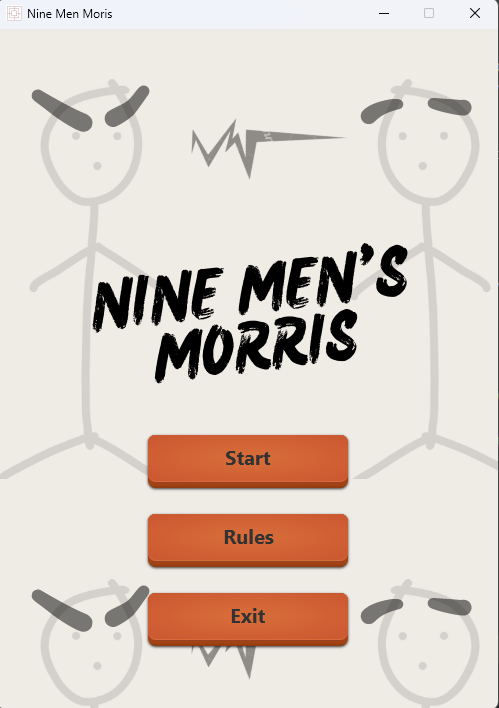
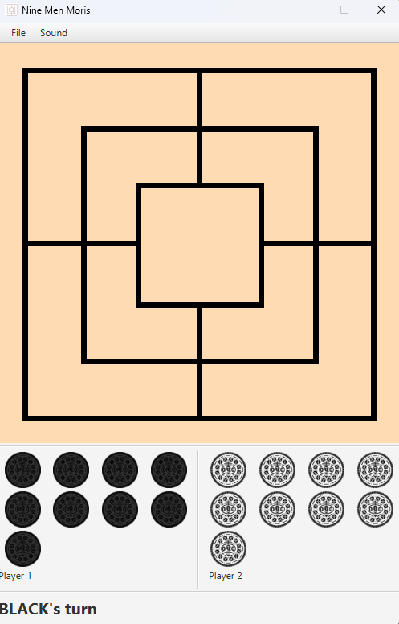

# Nine Men' Morris
<mark>**NEW!**</mark> Sprint 4 Demo Youtube Link: https://youtu.be/6x5lyS0EDVE  

## Introduction
Program is developed using Java and JavaFX.

## How to run the game
1. Download the latest release from [here](https://git.infotech.monash.edu/fit3077-s1-2023/MA_Thursday4pm_Team6/project/-/tree/main/Sprint%204/Releases).

2. Here are 1 versions, a **JAR file** (Preferred):
   - For Mac or Windows:
     - you will need Java 17 or above installed. 
     - Run the .jar file by double clicking on it or run it from the terminal in the folder using the command `java -jar 9mm-v4.jar`

Please note that the Windows Batch File is no longer maintained for Sprint 4, this includes the Nine_Men_Morris_Maven folder.

## How to compile and run the build on intelliJ
**To build our 9MM game, please follow the steps below:**
1. Clone the GitLab repository
2. Navigate to the 'Nine_Mens_Morris' directory and open it as a folder in IntelliJ IDEA.
3. Set up JavaFX in Intellij. You may refer this [video](https://www.google.com/url?sa=t&rct=j&q=&esrc=s&source=web&cd=&cad=rja&uact=8&ved=2ahUKEwiAxeq42Mn-AhXk1TgGHWZkCUAQwqsBegQICBAF&url=https%3A%2F%2Fwww.youtube.com%2Fwatch%3Fv%3DIvsvjUq38Jc&usg=AOvVaw0gUcKQI4-TAIw965WQCYux) or JavaFX's [website](https://openjfx.io/openjfx-docs/) if necessary.
4. Set up VM configuration for JavaFX (shown in last part of video) and run from there.

If the game runs successfully, you will see the game interface.

## Rules implemented so far
1. All basic rules have been implemented.
2. Advanced requirement has been fully implemented.

#### Advanced requirement chosen:

"A single player may play against the computer, where the computer will randomly play a
move among all of the currently valid moves for the computer, or any other set of
heuristics of your choice."

## IDE
IntelliJ IDEA

## Dependencies to build the project
- Java JDK 17.0.7
- JavaFX 17
- JavaFX Scene Builder (optional)

## Troubleshoot
If you face the error setting up JavaFX in intelliJ as shown below, it is likely that you have not set up JavaFX path correctly. Kindly update your path according to where you saved your JavaFX SDK.

This configuration can be found in the VM options of the Run/Debug Configurations.

## Generate JAR executable  file

**Instructions**

1. Open the 'Nine_Mens_Morris' folder in IntelliJ, it should load it as a Maven project.
2. If it doesn't, load the project using the Maven pop up on the bottom.
3. In IntelliJ, click on the **Maven** symbol in the toolbar at the right side of the screen.
4. Click on **Lifecycle** to expand it, and then double click on **package**.
5. Wait for Maven to build and package the JAR.
6. After you get the "BUILD SUCCESS" message, go to the target folder to access the generated JAR file.
7. Run the JAR file. There might be some warnings in the consoles, but they should be harmless.
8. Happy gaming!

**Video Tutorial**

## Generate BAT file (Only applicable for Sprint 3)

**Instructions**

1. Open 'Nine_Men_Morris_Maven' folder in IntelliJ IDEA.
2. Load project using the Maven pop up on bottom left.
3. In IntelliJ, click on the **Maven** symbol in the toolbar at the right side of the screen.
4. Click on Nine_Men_Morris > plugins > compiler > compiler:compile to compile the code.
5. Click on plugins > javafx > javafx:jlink to create an app.zip in target folder.

## Screenshots

## History

Sprint 3 Demo: https://youtu.be/z88bg2aQVc4

