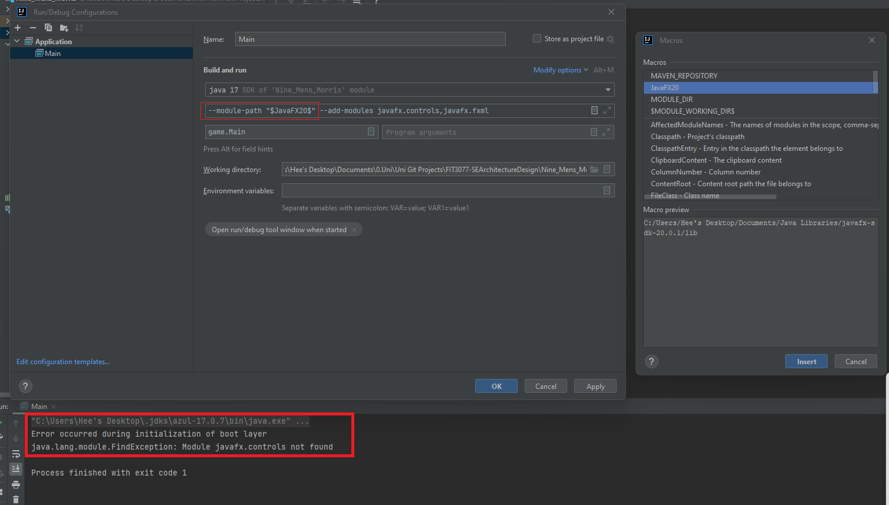
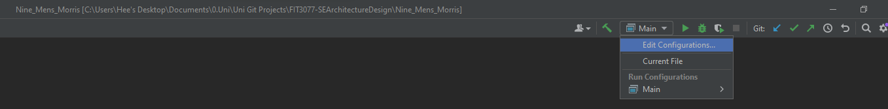

# FIT3077_project

    
Sprint 1

## Sprint 1

Sprint 1 deliverables can be accessed in the Sprint 1 folder.

Inside the folder we have:

**Submission Files (to be marked)**
1. FIT3077_MA_Thursday4pm_Team6_Sprint1.pdf - pdf version of our final report

**Raw Files**
1. FIT 3077 Sprint 1.docx - docx version of our final report
2. Domain_Model_Diagram.png - our final domain model in image format
3. FIT3077_Low_Fi.pdf - our final low fi design in pdf format
4. Link to Figma of Low Fi design - https://www.figma.com/file/d08PxGS7458D1rGAokS7z6/FIT3077?node-id=0%3A1&t=nH7AiapkJT6YEYUc-1
5. Link to LucidChart of Domain Model - https://lucid.app/lucidchart/c5b348e9-fff0-445e-91a6-2fbd5cc504a6/edit?viewport_loc=-573%2C0%2C2767%2C1283%2C0_0&invitationId=inv_1d200b7d-35f3-4467-9c7c-5faa16457771

	
Sprint 2

## Sprint 2

Sprint 2 documentation deliverables can be accessed in the Sprint 2 folder, while code deliverables are stored in the Nine_Mens_Morris folder.

Inside the Sprint 2 folder we have:

**Submission Files (to be marked)**
1. 9MM_UML.pdf - our uml diagram for Sprint 2
2. FIT3077_Sprint_2_Design_Rationale.pdf - our design rationale for Sprint 2

**To run our 9MM game, please follow the steps below:**
1. Clone the GitLab repository
2. Set up JavaFX in Intellij. You may reference this [video](https://www.google.com/url?sa=t&rct=j&q=&esrc=s&source=web&cd=&cad=rja&uact=8&ved=2ahUKEwiAxeq42Mn-AhXk1TgGHWZkCUAQwqsBegQICBAF&url=https%3A%2F%2Fwww.youtube.com%2Fwatch%3Fv%3DIvsvjUq38Jc&usg=AOvVaw0gUcKQI4-TAIw965WQCYux) or JavaFX's [website](https://openjfx.io/openjfx-docs/) if necessary.
3. Set up VM configuration for JavaFX and run from there.

*Attempt was made to create a jar file for the game, but it was unsuccessful. Hence, the game can only be run from Intellij.*

If the game runs successfully, you will see the interface below:

**Troubleshoot**  
If you face the error as shown below, it is likely that you have not set up JavaFX path correctly. Kindly update your path according to
where you saved your JavaFX SDK.

This configuration can be found in the VM options of the Run/Debug Configurations.

    
Sprint 3

## Sprint 3

Sprint 3 documentation deliverables can be found in the Sprint 3 folder, while source code for our 9MM game is stored in the Nine_Mens_Morris folder.

Inside the Sprint 3 folder we have:

**Submission Files (to be marked)**
1. Sequence Diagrams folder - containing 5 sequence diagrams illustrating 5 distinct interactions in our program
2. 9mm_UML_Sprint3.pdf - our current uml class diagram, updated for Sprint 3
3. FIT3077_Sprint_3_Design_Rationale.pdf - our design rationale for Sprint 3
4. Releases folder - containing .bat file for Windows and .jar for MacOs
5. Sprint 3 Youtube Demo: https://youtu.be/z88bg2aQVc4

Please refer to the readme in the Sprint 3 folder for more details on how to run our game.

## Sprint 4

Sprint 4 documentation deliverables can be found in the Sprint 4 folder, while source code for our 9MM game is stored in the Nine_Mens_Morris folder.

Inside the Sprint 4 folder we have:

**Submission Files (to be marked)**
1. 9mm_UML_Sprint4.pdf - our complete uml class diagram, updated and finalised for Sprint 4
2. FIT3077_Sprint_4_Design_Rationale.pdf - our design rationale for Sprint 4
3. Releases folder - containing .bat file for Windows and .jar for MacOs
4. Sprint 4 Youtube Demo: https://youtu.be/6x5lyS0EDVE

Please refer to the readme in the Sprint 4 folder for more details on how to run our game.

